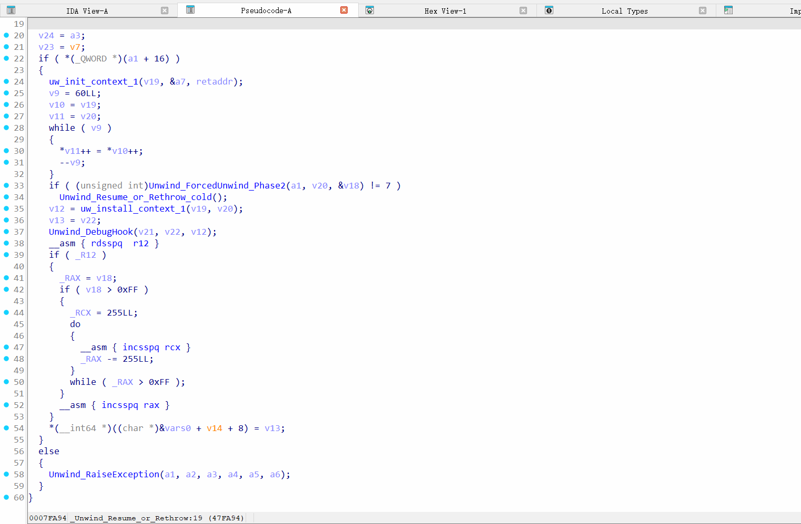

# ida_toys
a simple plugin for ida

The native highlight will disappear after the window is moved, so this is a plugin to persist the highlight matching {}

## usage
Move goodIDA.dll to IDADIR\plugins\
(The provided can only be used by 9.0, other version need build it yourself)

Double-click the line with {} to activate, again to cancel

